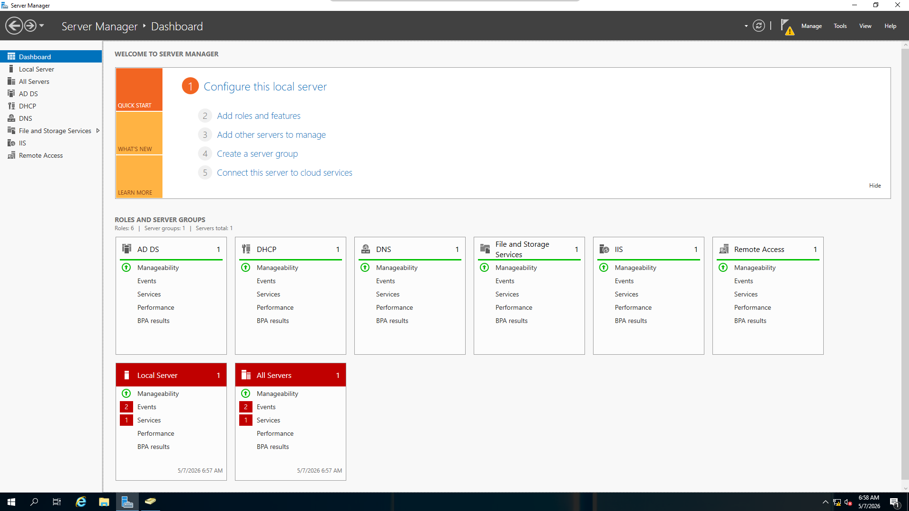
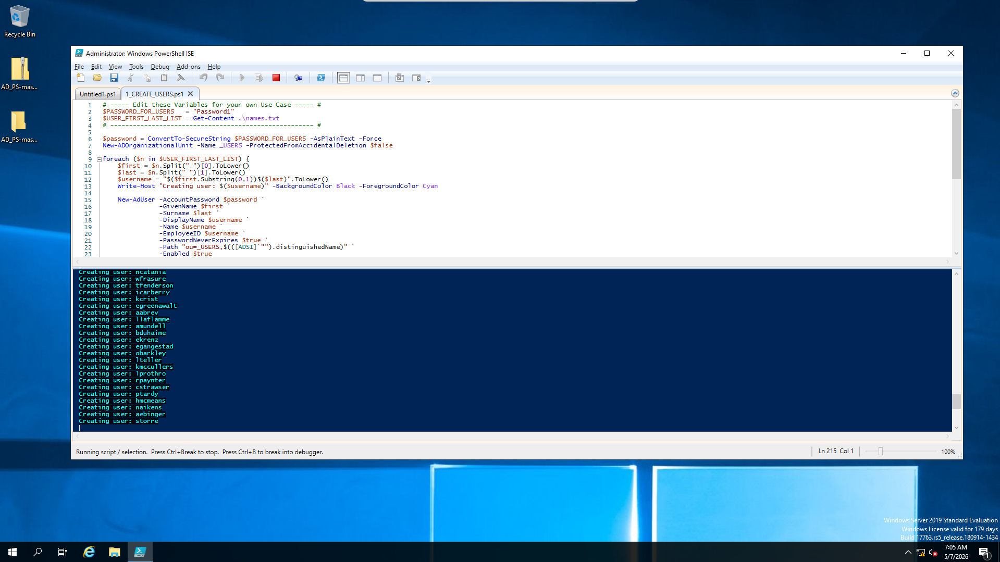

# 👥 Active Directory Home Lab

Windows Active Directory home lab built using VirtualBox and PowerShell automation.  
This project simulates a real enterprise IT environment with a Domain Controller, DNS, DHCP, and domain-joined client machines, including automated user provisioning.

---

## 🧠 Overview

This lab was built to practice and demonstrate Windows Server administration and core Active Directory concepts in a safe, isolated virtual environment using VirtualBox.

It includes domain configuration, network services, and PowerShell automation for user management.

---

## 🖥️ Infrastructure

**DC01 (Windows Server)**
- Active Directory Domain Services (AD DS)
- DNS Server
- DHCP Server

**Client Machine (Windows 10)**
- Joined to the domain

**Network Configuration**
- Internal VirtualBox Network
- NAT for internet access

---

## 🛠️ Technologies Used

- Windows Server 2019 / 2022
- Active Directory Domain Services (AD DS)
- DNS
- DHCP
- PowerShell
- Oracle VirtualBox
- Windows 10

---

## ⚙️ Features Implemented

- Active Directory Domain setup
- Organizational Units (OUs) creation
- Bulk user creation using PowerShell automation
- DHCP scope configuration
- DNS resolution inside the domain
- Domain join configuration (Windows 10 client)
- Internal network segmentation

---

## 🔥 PowerShell Automation

User provisioning in Active Directory was fully automated using a PowerShell script.

👉 View scripts here:  
https://github.com/Burkhardt0Patrick/Active-Directory-Lab/tree/main/scripts

---

## 📸 Screenshots

### 🖥️ Server Manager (DC01)


---

### 🌐 Active Directory (Before User Creation)
Initial state of Active Directory before user creation.


---

### 👥 Active Directory (After User Creation)
Users successfully created inside the `_USERS` Organizational Unit.


---

### 🔥 PowerShell User Creation (Automation)
Execution of PowerShell script for bulk user creation.



---

### 📡 DHCP IPv4 Scope
Configured DHCP IPv4 scope defining the IP range for clients.


---

### 📍 DHCP Address Pool
Defined IP address range assigned to DHCP clients.


---

### ⚙️ DHCP Scope Options
Configured gateway, DNS server, and domain name options.


---

### 📊 DHCP Leases
Active IP assignments issued to connected clients.


---

## 🎯 What I Learned

- Windows Server administration (AD DS, DNS, DHCP)
- Active Directory structure and user management
- PowerShell scripting for automation
- Network configuration and IP management
- Domain-based infrastructure concepts
- Virtual machine networking using VirtualBox

---

## 🚀 Future Improvements

- Group Policy Objects (GPOs)
- File server with permissions and shares
- Centralized logging and monitoring
- Security hardening policies
- SIEM integration (Splunk / ELK Stack)

---

## 📁 Project Structure

```text
scripts/
├── create-users.ps1
└── names.txt

images/
├── server-manager.png
├── ad-empty.png
├── ad-users.png
├── powershell-script.png
├── dhcp-ipv4.png
├── dhcp-address-pool.png
├── dhcp-scope-options.png
└── dhcp-leases.png
